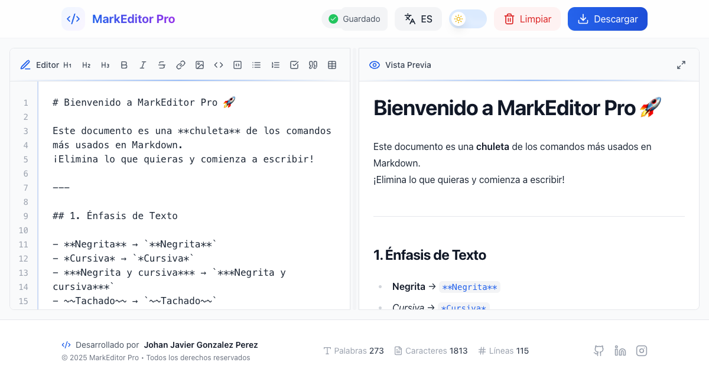
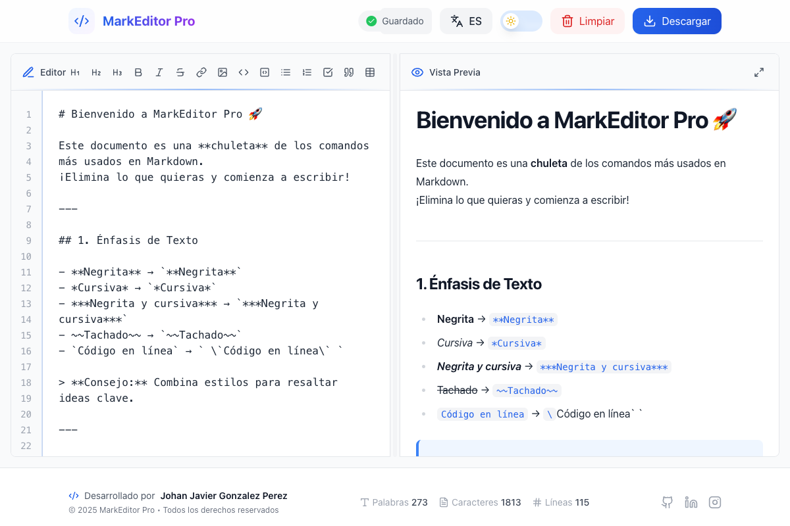
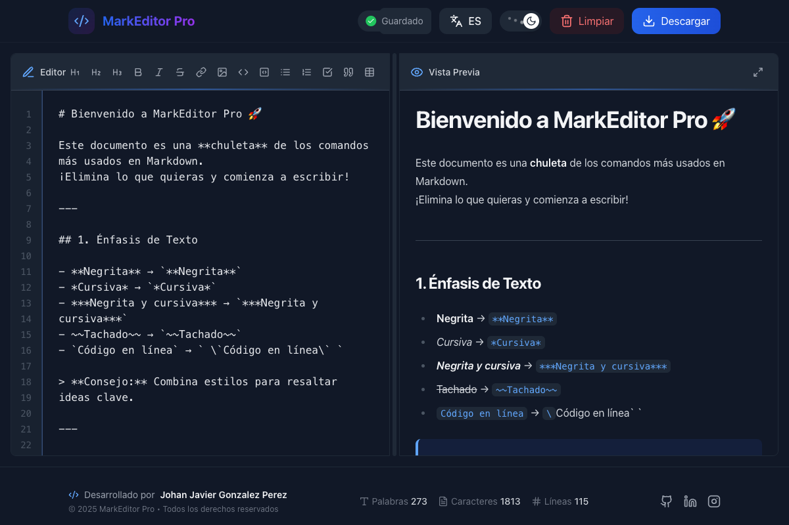
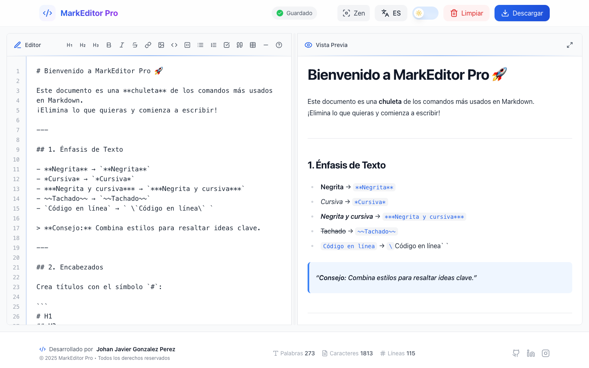
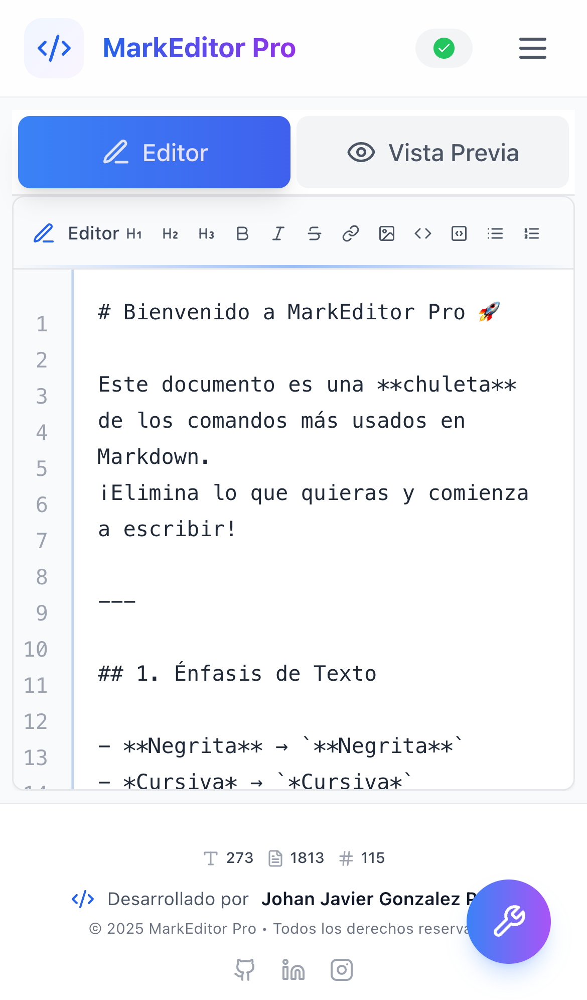
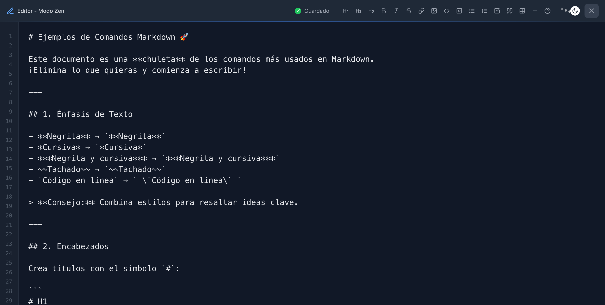

# MarkEditor Pro ✨📝

<div align="center">



[](https://github.com/JavierGonzalez045)
[](https://reactjs.org/)
[](https://nextjs.org/)
[](https://tailwindcss.com/)

<br />

Editor de Markdown, autoguardado inteligente, previsualización instantánea y soporte multiidioma.

[🌟 Demo en Vivo](https://markdown-editor-jgp.vercel.app/) | [🚀 Características](#-características-principales) | [💻 Instalación](#-instalación)

<br />

</div>

## 🌟 Capturas de Pantalla

### Modo Claro y Oscuro

<table>
  <tr>
    <td align="center">
      <b>Claro</b><br>
      
    </td>
    <td align="center">
      <b>Oscuro</b><br>
      
    </td>
  </tr>
</table>

### Modo Escritorio



### Modo Móvil



### Modo Zen



## 🚀 Características Principales

<table>
  <tr>
    <td align="center">
      
      <br />
      <b>Contador Inteligente</b>
      <br />
      <p>Monitoreo en tiempo real de palabras, caracteres y líneas</p>
    </td>
    <td align="center">
      
      <br />
      <b>Tema Oscuro/Claro</b>
      <br />
      <p>Alterna entre temas con una elegante animación</p>
    </td>
    <td align="center">
      
      <br />
      <b>Vista en Tiempo Real</b>
      <br />
      <p>Previsualiza tu documento mientras escribes</p>
    </td>
    <td align="center">
      
      <br />
      <b>Modo Zen</b>
      <br />
      <p>Escritura sin distracciones para máxima concentración</p>
    </td>
  </tr>
  <tr>
    <td align="center">
      
      <br />
      <b>Autoguardado</b>
      <br />
      <p>Nunca pierdas tu trabajo con guardado automático</p>
    </td>
    <td align="center">
      
      <br />
      <b>Multiidioma</b>
      <br />
      <p>Interfaz disponible en Español e Inglés</p>
    </td>
    <td align="center">
      
      <br />
      <b>Diseño Responsivo</b>
      <br />
      <p>Optimizado para todos los dispositivos</p>
    </td>
    <td align="center">
      
      <br />
      <b>Atajos de Teclado</b>
      <br />
      <p>Accesos rápidos para productividad máxima</p>
    </td>
  </tr>
</table>

## 🛠 Tecnologías

<div align="center">


</div>

- **Frontend**: React 18.2.0, Next.js 14
- **Estilos**: TailwindCSS 3.3.2, CSS Modules
- **Animaciones**: Framer Motion 10.16.4
- **Internacionalización**: i18next
- **Markdown**: react-markdown, remark-gfm
- **Iconos**: Lucide React
- **Estado**: React Context API
- **Código**: Syntax Highlighter con Prism

## 💻 Instalación

### Prerrequisitos

- Node.js 16.0 o superior
- npm, yarn o pnpm

### Pasos de Instalación

1. Clona el repositorio:

   ```bash
   git clone https://github.com/JavierGonzalez045/markeditor-pro.git
   cd markeditor-pro
   ```

2. Instala las dependencias:

   ```bash
   npm install
   # o
   yarn install
   # o
   pnpm install
   ```

3. Inicia el servidor de desarrollo:

   ```bash
   npm run dev
   # o
   yarn dev
   # o
   pnpm dev
   ```

4. Abre [http://localhost:3000](http://localhost:3000) en tu navegador

## 🚀 Despliegue en Vercel

1. Crea una cuenta en [Vercel](https://vercel.com)
2. Conecta tu repositorio de GitHub
3. Configura las variables de entorno (si las haya)
4. Haz clic en "Deploy"

O usa el botón de despliegue rápido:

[](https://vercel.com/new/clone?repository-url=https://github.com/JavierGonzalez045/markeditor-pro)

## 🎯 Atajos de Teclado

| Atajo            | Acción            |
| ---------------- | ----------------- |
| Ctrl + B         | Negrita           |
| Ctrl + I         | Cursiva           |
| Ctrl + K         | Enlace            |
| Ctrl + Shift + X | Tachado           |
| Ctrl + `         | Código en línea   |
| Ctrl + Alt + 1   | Encabezado 1      |
| Ctrl + S         | Guardar/Descargar |
| Esc              | Salir modo Zen    |

## 🔒 Seguridad

- Sanitización de entrada para prevenir XSS
- Rate limiting para proteger contra DDoS
- Headers de seguridad configurados
- Content Security Policy implementada
- Validación de tamaño de archivos

## 👨‍💻 Autor

**Johan Javier Gonzalez Perez**

- LinkedIn: [Johan Javier Gonzalez Perez](https://www.linkedin.com/in/johanjaviergonzalezperez/)
- Instagram: [@javiergonzalez045](https://www.instagram.com/javiergonzalez045/)

<div align="center">  
⭐ Si este proyecto te ayudó, considera darme una estrella en GitHub ⭐  
</div>
